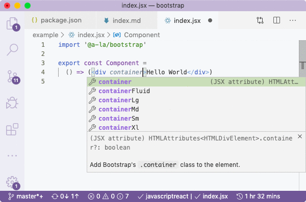

# @a-la/bootstrap

[](https://www.npmjs.com/package/@a-la/bootstrap)

`@a-la/bootstrap` is Bootstrap Class Properties, Elements And Types Definitions For JSX.

<p align="center">
  
</p>

```sh
yarn add -D @a-la/bootstrap
npm i --save-dev @a-la/bootstrap
```

## Table Of Contents

- [Table Of Contents](#table-of-contents)
- [Usage](#usage)
- [Bootstrap Classes](#bootstrap-classes)
- [Closure Stylesheets](#closure-stylesheets)
- [Copyright & License](#copyright--license)

<p align="center"><a href="#table-of-contents">
  
</a></p>

## Usage

By installing this package, you will be able to specify classes on tags and components as JSX properties when using [`alamode`](https://github.com/a-la/alamode) transpiler.

To receive access to auto-completions, you'll need to import the `@a-la/bootstrap` package in your source code:

```jsx
import '@a-la/bootstrap'

export const Component =
  () => (<div container>Hello World</div>)
```

The actual import doesn't do anything as the source file is blank. It is needed only for VSCode to pick up distributed typings.

Because of [a bug](https://github.com/microsoft/TypeScript/issues/28905) in VSCode, you won't see properties with hyphens, e.g., `container-fluid` and will only see `containerFluid`, but you can actually use both. The camel cases are added for discoverability of classes.

<p align="center"><a href="#table-of-contents">
  
</a></p>

## Bootstrap Classes

See the <kbd>📙 [full list of Bootstrap classes](../../wiki/Classes)</kbd> in Wiki.

<p align="center"><a href="#table-of-contents">
  
</a></p>

## Closure Stylesheets

An annotated version of Bulma 0.8.0 is available in `bootstrap/bootstrap.css` where `/* @alternate */` annotations were added for compatibility with [Closure Stylesheets](https://github.com/artdecocode/closure-stylsheets-java).

<p align="center"><a href="#table-of-contents">
  
</a></p>

## Copyright & License

GNU Affero General Public License v3.0

<table>
  <tr>
    <th>
      <a href="https://www.artd.eco">
        
      </a>
    </th>
    <th>© <a href="https://www.artd.eco">Art Deco™</a> for <a href="https://alamode.cc">À La Mode</a> 2020</th>
  </tr>
</table>

<p align="center"><a href="#table-of-contents">
  
</a></p>